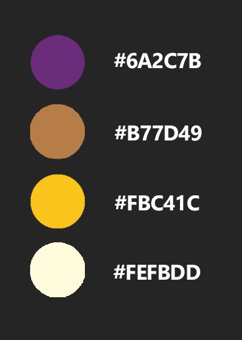
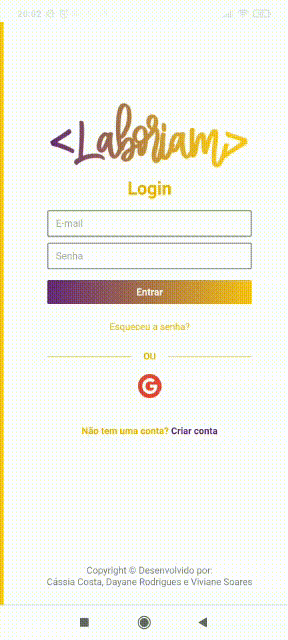
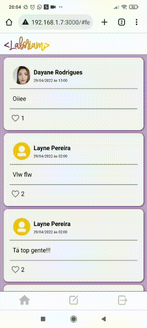
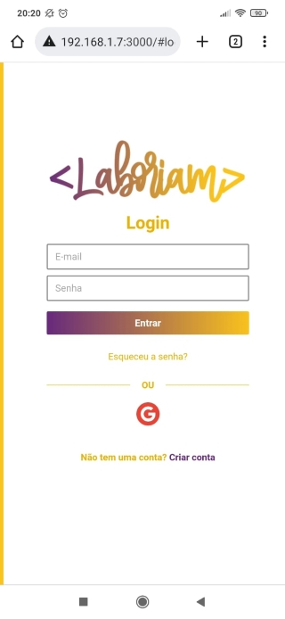
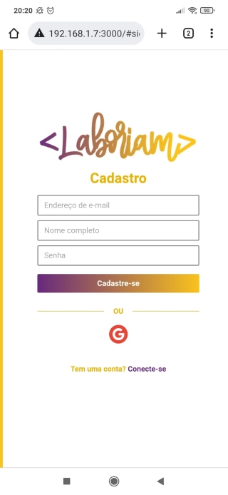
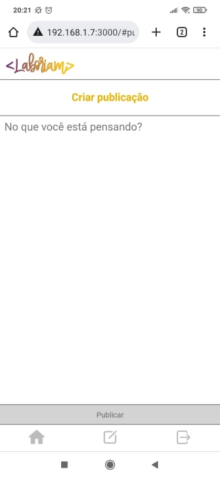

# LABORIAM


## Índice

* [1. Definição do Produto](#1-definição-do-produto)
* [2. História de Usuário](#2-historia-de-usuario)
* [3. Protótipos](#3-prototipos)
* [4. Resultado](#4-resultado)
* [5. Objetivos de Aprendizagem](#5-objetivos-de-aprendizagem)
* [6. Estrutura dos Arquivos](#6-estrutura-dados)
* [7. Desenvolvedoras](#7-desenvolvedoras)
* [8. Considerações Finais](#8-configurações-finais)

***


## 1. Definição do Produto

A Laboriam é uma rede social desenvolvida para mulheres graduadas, que estão em processo de desenvolvimento no Bootcamp ou até mesmo meninas que tem interesse de conhecer melhor o projeto da Laboratória,compartilhar vivências e experiencias que adquiriram no bootcamp , ou da vida profissional como desenvolvedora. O seu principal objetivo é promover a interação e comunicação entre usuárias. 

A intenção é apresentar para o público uma aplicação intuitiva e aconchegante que propicie uma ótima experiência de usuário.

O seu design é mobile first também responsivo para tablet e desktop, o que proporciona a versatilidade e adaptabilidade desejada pelos usuários. A sua idealização foi feita a partir de protótipos de baixa e de alta fidelidade que nortearam a construção do site de acordo com as necessidades dos clientes. Nele, é possível criar uma conta de acesso, logar-se com ela, criar, editar, deletar e dar likes em publicações. Além disso, existe uma área editável de perfil, onde o cliente pode alterar sua imagem de exibição.


## 2. História de Usuário

### História de usuário 1: 
 Como usuária, gostaria de me cadastrar em uma rede social direcionada para quem ja participou do Bootcamp da Laboratória, ou para quem esta participando ou quem gostaria de participar, onde elas relatam suas experiências e vivências no mundo do desenvolvimento

<b> Critérios de aceitação</b>

- [x] Novos usuários podem registrar-se usando um e-mail ou uma conta Gmail.
- [x] Não poderá ser feito o cadastro de usuários repetidos.
- [x] Somente usuários com contas válidas têm acesso permitido.
- [x] A conta do usuário deve ser um email válido.
- [x] O que o usuário digita no campo de senha (input) deve ser secreto.

### História de usuário 2: 
Como usuário de uma rede social gostaria de fazer publicações e vizualizar as publicações de outras usuarias 

<b>Critérios de Aceitação</b>

- [x] Conseguir publicar um post.
- [x] Poder excluir uma postagem específica.
- [x] Poder editar uma postagem específica.
- [x] Solicitar confirmação antes de excluir um post.
- [x] Ao clicar em editar um post, permitir que o usuário edite o texto e salve as alterações.
 
### História de usuário 3: 
Como usuário de uma rede social , gostaria de interagir nas publicações 

<b>Critérios de Aceitação</b>

 - [x] Poder dar e remover likes em uma publicação. Máximo de um por usuário.
 - [x] Visualizar contagem de likes.


## 3. Protótipos


### 3.1 Paleta de Cores




## 4. Resultado

### Usabilidade 




### Resultado Final do App






## 5. Objetivos de Aprendizagem

* O objetivo principal de aprendizagem deste projeto é construir uma Single-page Application (SPA). Trabalhamos com as seguintes tecnologias/ferramentas:

- [x] **HTML**

- [x] **CSS**

- [x] **JavaScript**

- [x] **Firebase**

- [x] **Jest**

- [x] **Git e Github**


## 6. Estrutura dos Arquivos

```text
.
├── functions
├── node_modules
├── src
|  ├── dependencies 
|  |      └── config-firebase.js
|  ├── img
|  ├── pages 
|  |  |  └── components
|  |  |  |   └── menu.js
|  |  |  └── feed.js
|  |  |  └── login.js
|  |  |  └── publish.js
|  |  |  └── signup.js
|  ├── routes
|  |  |  └── index.js
|  ├── services
|  |  |  └── authentication.js
|  |  |  └── firestore.js
|  ├── styles
|  |  |  └── feed.css
|  |  |  └── global.css
|  |  |  └── login-signup.css
|  |  |  └── publish.css
|  ├── index.html
└── test
|   └── index.spec.js
├── .eslintrc
├── .firebaserc
├── .gitignore
├── babel.config.js
├── firebase.json
├── firestore-debug.log
├── firestore-indexes.json
├── firestore.rules
├── package-lock.json
├── package.json
├── README.md
├── stylelint.config.js

```

## 7. Desenvolvedoras

 [Cássia Costa](https://github.com/CassiaCosta)

 [Dayane Rodrigues](https://github.com/dayanersilva)

 [Viviane Soares](https://github.com/vivisoares)

 ## Considerações Finais

- [x] O planejamento deste projeto se encontra no [Trello](https://trello.com/b/eULNHORK/social-network)
- [x] O deploy deste projeto está hospedado no [GitPages]()


